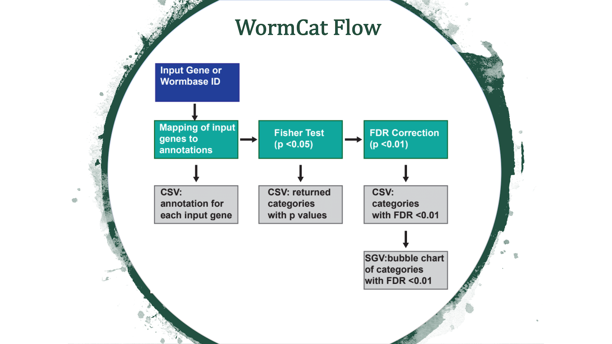
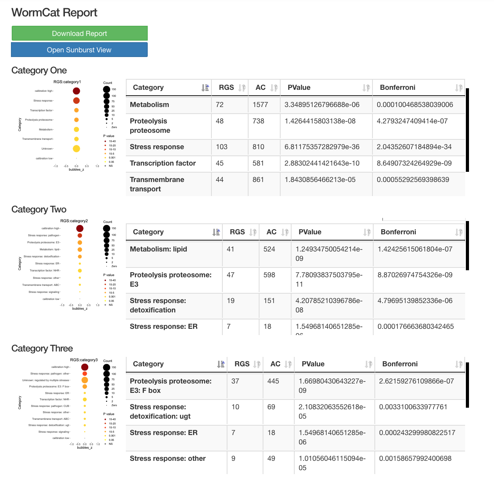
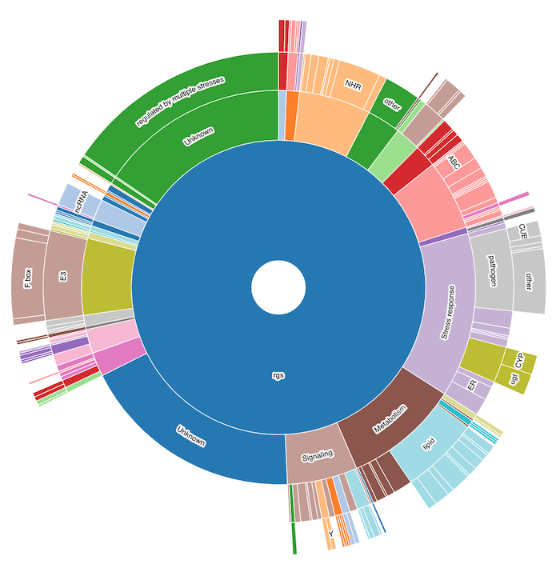

# Analysis of genome-scale data with WormCat identifies novel enriched gene categories in studies from metabolic, tissue-specific, and lifespan-drug data

#### Authors: Amy Holdorf, Daniel Higgins, Anne Hart, Peter Boag, Gregory Pazour, Marian Walhout,and Amy Walker

[GENETICS February 1, 2020 vol. 214 no. 2 279-294;](https://academic.oup.com/genetics/article/214/2/279/5930455)

## Abstract
The emergence of large sets of gene regulation data has revealed the need for improved tools to 1) identify enriched functional gene categories and 2) visualize enrichment patterns across comparative datasets.  Gene ontogeny enrichment (GO) has several limitations for C. elegans analysis. First, around 30% of C. elegans genes are not represented in commonly used search engines. Second, it is difficult to compare multiple GO analyses. To allow visualization and categorization of C. elegans gene sets, we have developed a web-based tool, WormCat.  This tool uses a near complete annotation of C. elegans genes to determine category enrichment and define potential co-regulated or co-functioning gene sets. Then WormCat provides a scaled heat map for visualization along with enrichment statistics and annotation of each input gene. We have developed an annotation strategy based on a nested category approach where each gene is annotated at three levels.  Enrichment scores are generated at each level, allowing both broad (Cat1) and more detailed analysis (Cat2, Cat3).  Using WormCat on published RNA seq datasets from metabolic, tissue-specific or after treatment with lifespan-increasing drugs, we show that WormCat finds major categories appearing in GO searches and also identifies additional enriched categories that are informative for interpreting phenotypes or predicting biological function.  Thus, WormCat is a powerful tool that will allow a sophisticated analysis of gene enrichment in different types of C. elegans datasets.

## Overview Wormcat
Wormcat is also available as an online tool at [www.wormcat.com](http://www.wormcat.com); the online version greatly simplifies the use of Wormcat and is maintained by the [Walker Lab at UMASS Medical School](https://amywalkerlab.com/).

###### The diagram below shows the flow of the Wormcat process:

###### The diagrams below shows sample output from a Wormcat.com run:

##### Starburst view of categorical data

